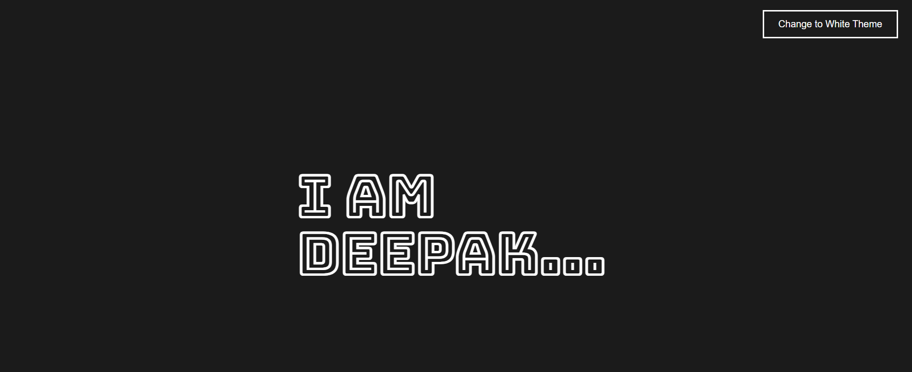
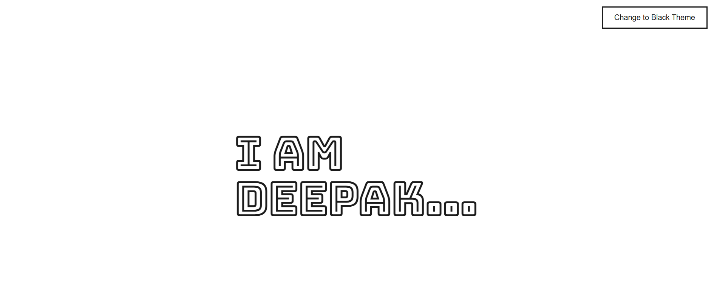

# 🎨 Color Toggler (React Project)

A simple and interactive **Color Toggler** built using React. This project allows users to switch between light and dark themes with a single button click.

---

## 🚀 Features

* Toggle between **Light Mode** and **Dark Mode**
* Dynamic background, text, and button color changes
* Built using **React Hooks (`useState`)**
* Clean and minimal UI

---

## 🛠️ Tech Stack

* React.js
* JavaScript (ES6+)
* CSS

---

## ⚙️ How It Works

* The app uses **three state variables**:

  * `backgroundColor` → controls page background
  * `textColor` → controls text color
  * `buttonColor` → controls button background

* On button click:

  * Colors toggle between **white** and **dark (#1b1b1b)**
  * UI updates dynamically using inline styles

---

## 📸 Preview

👉 Add a screenshot here (optional)

```


```

---

## ▶️ Getting Started

1. Clone the repository:

```
git clone https://github.com/your-username/color-toggler.git
```

2. Navigate to the project folder:

```
cd color-toggler
```

3. Install dependencies:

```
npm install
```

4. Run the app:

```
npm run dev
```

---

